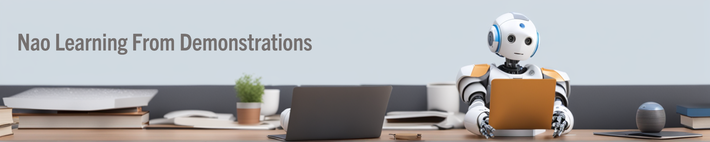

# **Nao Learning From Demonstrations**

[](https://www.python.org/downloads/release/python-380/)
[](https://www.coppeliarobotics.com/)



Welcome to the **Nao Learning From Demonstrations** repository! This project integrates robotic control, machine learning, and simulation environments for real-world and virtual robotic tasks. From motion prediction to grasping and pushing simulations, this repository provides all the necessary tools and scripts.

---

## **Project Overview**

This repository is organized into several modules and folders, each designed to handle specific aspects of robotic control and simulation:

- [**KinectSkeleton**](./KinectSkeleton/README.md): Processes skeleton data captured from Kinect sensors for motion mapping.
- [**Notebooks**](./Notebooks/README.md): Jupyter notebooks for training machine learning models.
- [**PostProcessing**](./PostProcessing/README.md): Prepares and cleans datasets for training and evaluation.
- [**RealWorldScripts**](./RealWorldScripts/README.md): Integrates models and robotic control for real-world tasks.
- [**Simulation**](./Simulation/README.md): Scripts and scene files for simulating robotic interactions in CoppeliaSim.

---

## **Features**

### 🎯 **Motion Prediction**
- Train machine learning models to predict robotic arm movements.
- Supports tasks like grasping, pushing.

### 🛠️ **Simulation Integration**
- CoppeliaSim scenes for realistic simulations.
- Includes grasping and pushing tasks with detailed configurations.

### 📊 **Data Processing and Training**
- Scripts for cleaning, interpolating, and labeling data.
- Jupyter notebooks for model development and evaluation.

### 🌐 **Real-World Deployment**
- Supports integration with robotic arms and Kinect sensors.
- Endpoints for model predictions and robotic control.

---

## **Getting Started**

1. **Clone the Repository**:
   ```bash
   git clone https://github.com/TaarLab/NaoLfD.git
   cd NaoLfD
   ```

2. **Set Up Dependencies**:
   - Install Python requirements:
     ```bash
     pip install -r requirements.txt
     ```
   - Install CoppeliaSim.

3. **Explore Modules**:
   - Train models in `Notebooks` or process data in `PostProcessing`.

4. **Real-World Integration**:
   - Set up Kinect sensors or robotic arms and run `RealWorldScripts`.