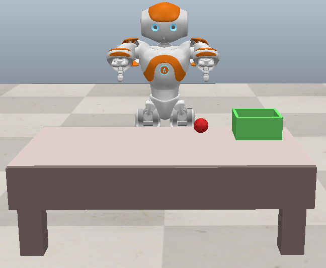
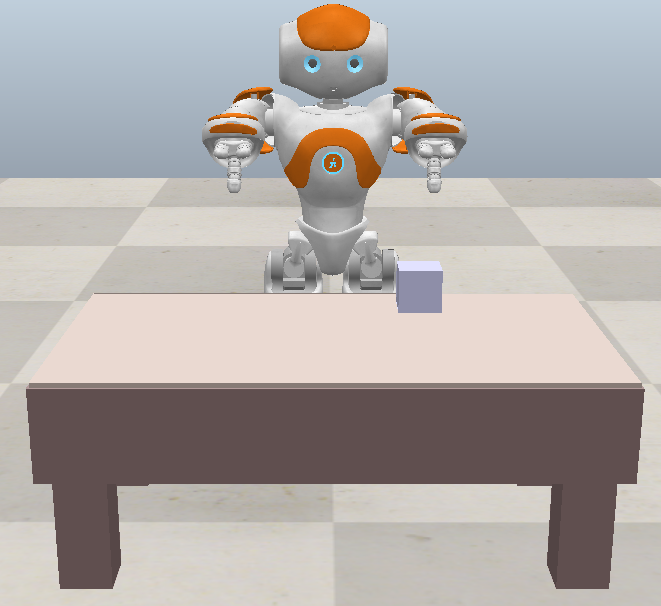

# **Simulation Overview**

The **Simulation** folder contains scripts, configuration files, and scene files for simulating robotic motion and interactions using the CoppeliaSim platform. These simulations utilize trained models for joint movement prediction and evaluate robotic tasks in virtual environments.

---

## **Scripts**

### **1. coppeliasim.py**
- **Purpose**: Core simulation script for running robotic motion simulations in CoppeliaSim.
- **Key Features**:
  - Interfaces with CoppeliaSim through the ZMQ remote API.
  - Controls robot joints based on trained model predictions.
  - Includes functionality for extracting simulation features such as joint angles, object positions, and distances.

---

### **2. coppeliasim_branching.py**
- **Purpose**: Implements separate models for different tasks (e.g., grasping and dropping).
- **Key Features**:
  - Uses branching logic to load task-specific models.
  - Adapts predictions based on the current task and environment context.
  - Outputs joint angles for task-specific robotic movements.

---

### **3. coppeliasim_pushing.py**
- **Purpose**: Specializes in simulations involving pushing tasks.
- **Key Features**:
  - Integrates object detection and depth perception.
  - Simulates pushing motions with a focus on object-target alignment.
  - Utilizes task-specific models for accurate joint movement prediction.

---

### **4. simulation_server.py**
- **Purpose**: Provides an HTTP-based API to control the robot in simulation.
- **Key Features**:
  - Accepts joint angle updates via POST requests.
  - Sends current joint angles and object positions in response to GET requests.
  - Includes safeguards to ensure joint movements remain within safe limits.

---

### **5. simulation_client.py**
- **Purpose**: Client script to send commands to the simulation server.
- **Key Features**:
  - Sends joint angle data to update robot movements in the simulation.
  - Retrieves simulation state for visualization or further analysis.

---

## **Scene Files**

### **1. world.ttt**
- **Purpose**: Simulation scene for the grasping task.
- **Key Features**:
  - Includes a robotic arm, objects to grasp, and predefined positions for tasks.
  - Used in conjunction with `coppeliasim.py` and `coppeliasim_branching.py`.

#### Grasping Environment Preview:

---

### **2. world_pushing.ttt**
- **Purpose**: Simulation scene for the pushing task.
- **Key Features**:
  - Contains a robotic arm, objects, and target areas for pushing.
  - Used with `coppeliasim_pushing.py`.

#### Pushing Environment Preview:
